# word_extractor 흐름도

각 다이어그램은 노드 7개 이하로 제한해 단계별로 쪼갬.

## 1. 실행 진입점 (run.sh → pipeline.py)

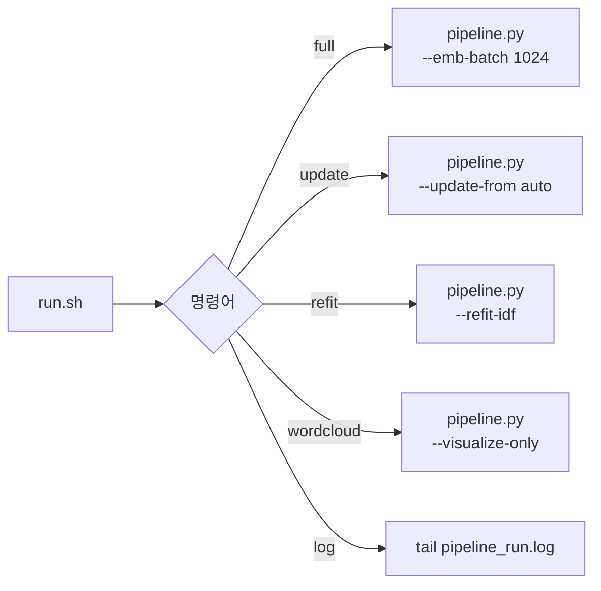

## 2. 파이프라인 전체 단계 (pipeline.py)

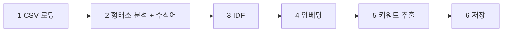

## 3. Stage 1 · CSV 로딩 & 전처리 (01_preprocess.py)

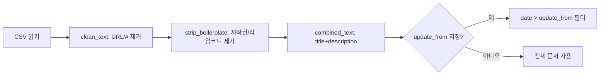

## 4. Stage 2a · 형태소 태깅 (02_tokenize.py)

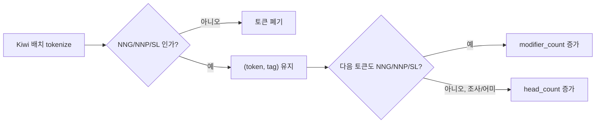

## 4b. Stage 2b · 수식어 비율 산출

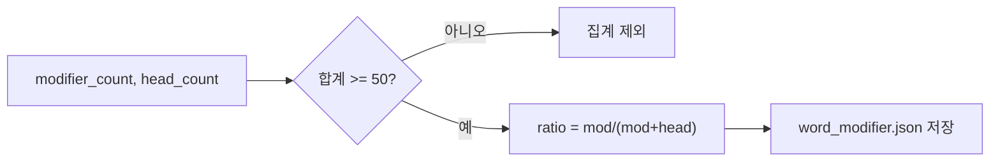

## 5. Stage 3 · IDF 계산/로드/증분 (03_idf.py)

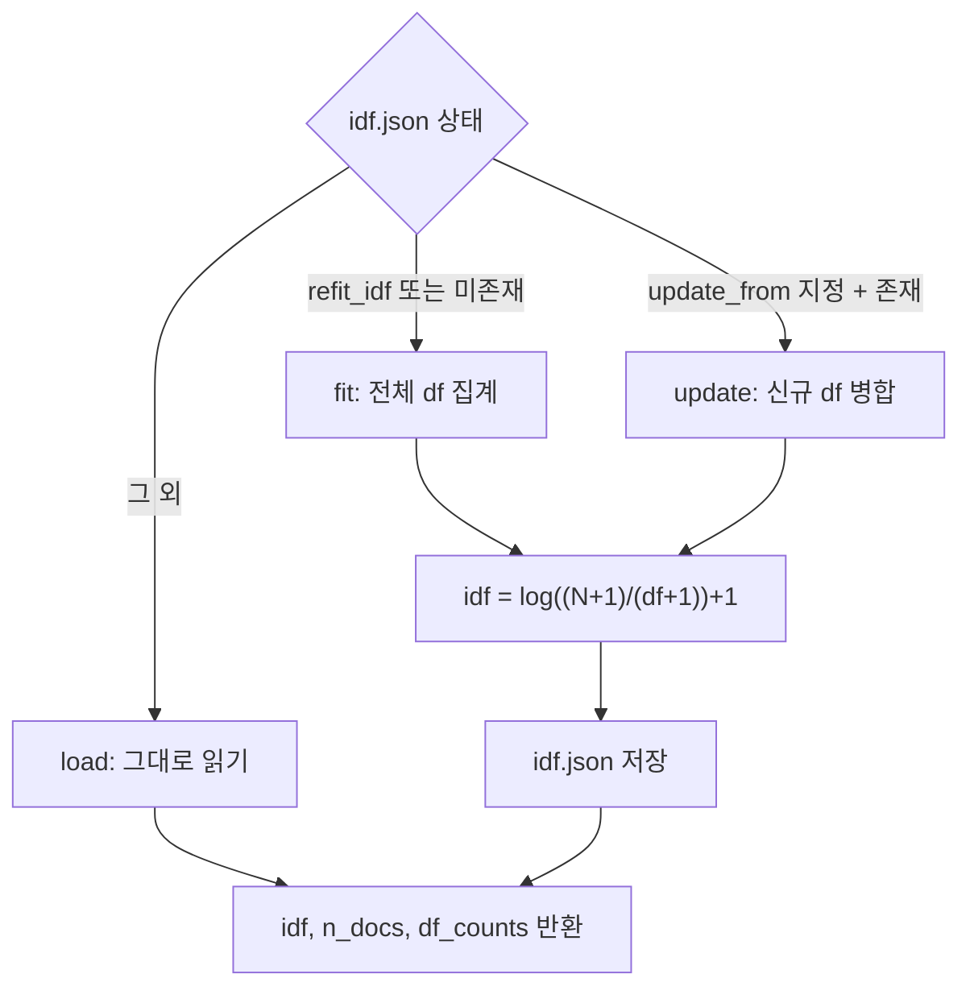

## 6. Stage 5 · 문서별 키워드 필터 체인 (pipeline.py + 04_extract.py)

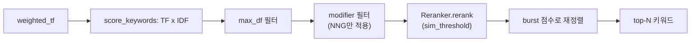

burst 공식: `score / (df/n_docs + burst_smooth/n_docs)` — df가 낮을수록(희귀할수록) 상위.

## 6b. Stage 5 상세 · Reranker.rerank (05_rerank.py)

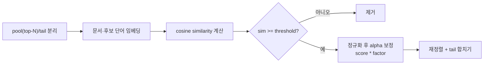

## 7. Stage 6 · 결과 저장 (pipeline.py)

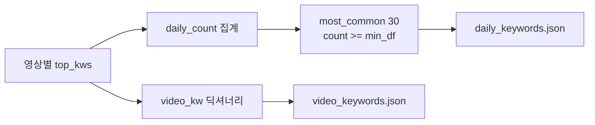

## 8. 워드클라우드 생성 (06_visualize.py)

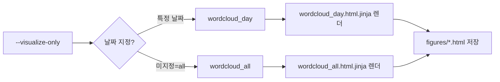

## 9. 산출물 맵

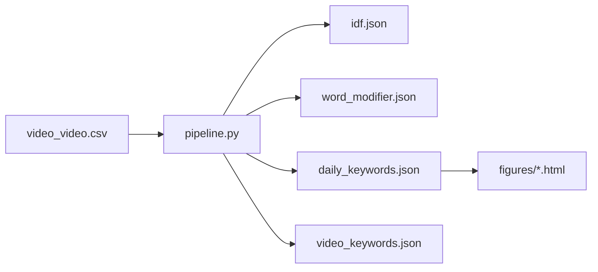
